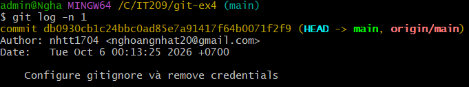

# Bài thực hành Git - `.gitignore`, `git rm --cached` và `git commit --amend`


## 1. Các bước thực hiện

### Bước 1: Tạo file credentials.txt

Tạo file `credentials.txt` chứa thông tin giả lập:

```text
username=admin
password=123456
```

Sau đó cố tình đưa file vào Git:

```bash
git add credentials.txt
git commit -m "Add credentials file by mistake"
```

### Bước 2: Cấu hình .gitignore

Tạo file `.gitignore` và thêm nội dung:

```gitignore
credentials.txt
```

Mục đích là yêu cầu Git bỏ qua file `credentials.txt` trong những lần theo dõi sau.

### Bước 3: Gỡ credentials.txt khỏi Git cache

Sử dụng lệnh:

```bash
git rm --cached credentials.txt
```

Lệnh này chỉ loại bỏ file khỏi vùng theo dõi của Git và không xóa file vật lý khỏi thư mục làm việc.

Kiểm tra file vẫn còn:

```bash
ls
```

File `credentials.txt` vẫn tồn tại trong thư mục làm việc.

### Bước 4: Commit thay đổi

Thêm file `.gitignore`:

```bash
git add .gitignore
```

Sau đó commit:

```bash
git commit -m "Remove credentials from Git tracking"
```

### Bước 5: Sử dụng git commit --amend

Sửa lại thông điệp của commit gần nhất bằng:

```bash
git commit --amend -m "Configure gitignore and remove credentials from tracking"
```

Lệnh `--amend` thay thế commit gần nhất bằng một commit mới có nội dung hoặc thông điệp được chỉnh sửa.

## 2. Kiểm tra kết quả

Kiểm tra trạng thái:

```bash
git status
```

Kết quả:

```text
nothing to commit, working tree clean
```

Kiểm tra lịch sử commit gần nhất:

```bash
git log -n 1
```

Commit gần nhất hiển thị thông điệp:

```text
Configure gitignore and remove credentials from tracking
```

Kiểm tra file vật lý:

```bash
ls
```

File:

```text
credentials.txt
```

vẫn tồn tại trong thư mục làm việc.

 ## Kết quả `git log -n 1`


